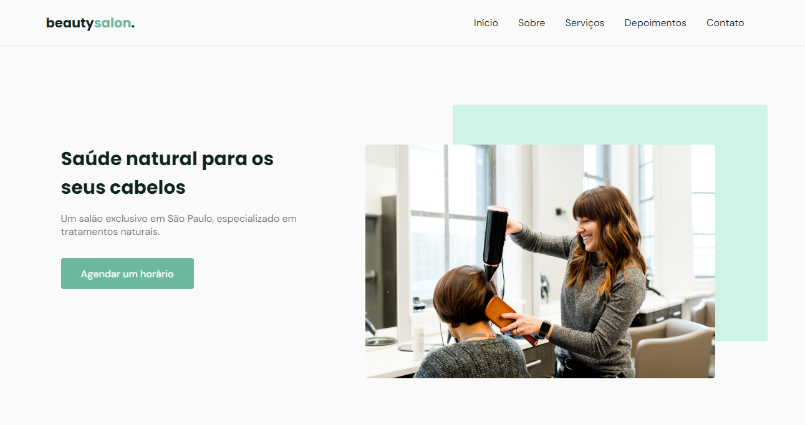

# Projeto Beautysalon

## 💻 Sobre
Projeto OriginSix - Rocketseat. Site feito com objetivo de aprender e aprofundar mais no HTML, CSS e Javascript.

## 🤯 O site é composto por:
- Home: Apresentação da marca;
- Sobre nós: História da empresa;
- Serviços: Serviços oferecidos pela marca;
- Depoimentos: Depoimentos de clientes da Beautysalon;
- Contato: Seção para os leads entrarem em contato.

## 🧠 Tecnologias utilizadas

## 📚 Alguns conceitos aplicados
- Semântica HTML;
- Pontos de acessibilidade;
- Responsividade;
- Mobile first;
- Utilização da biblioteca JS Scroll Reveal;
- Utilização da biblioteca JS Swiper.

## Feito por:
👤 Gabriel Borges
- Github: [@GSBorges](https://github.com/GSBorgess)
- LinkedIn: [Gabriel Borges](https://www.linkedin.com/in/gabriel-borges-03a721240/)